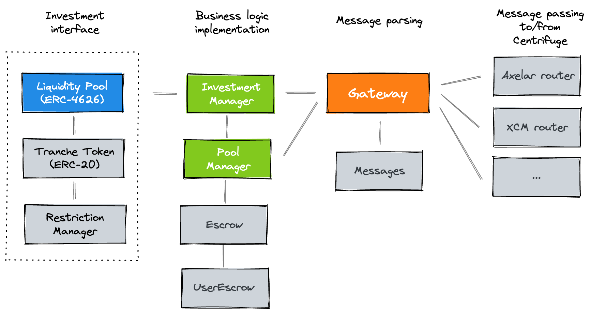

<p align="center">
  <a href="https://github.com/code-423n4/2023-09-centrifuge">
    
  </a>

  <p align="center">
    The institutional ecosystem for onchain credit.
    <br />
    <a href="https://centrifuge.io/" target="_blank"><strong>View our website »</strong></a> &nbsp; <a href="https://docs.centrifuge.io/" target="_blank"><strong>Read the documentation »</strong></a> &nbsp; <a href="https://app.centrifuge.io/" target="_blank"><strong>Try the app »</strong></a>
  </p>


# Centrifuge audit details
- Total Prize Pool: $60,000 USDC
  - HM awards: $42,500 USDC
  - Analysis awards: $2,500 USDC
  - QA awards: $1,250 USDC
  - Bot Race awards: $3,750 USDC
  - Gas awards: $0 USDC 
  - Judge awards: $6,000 USDC
  - Lookout awards: $3,500 USDC 
  - Scout awards: $500 USDC 
- Join [C4 Discord](https://discord.gg/code4rena) to register
- Submit findings [using the C4 form](https://code4rena.com/contests/2023-09-centrifuge/submit)
- [Read our guidelines for more details](https://docs.code4rena.com/roles/wardens)
- Starts September 8, 2023 20:00 UTC 
- Ends September 14,2023 20:00 UTC 

## Automated Findings / Publicly Known Issues

Automated findings output for the audit can be found [here](https://github.com/code-423n4/2023-09-centrifuge/blob/main/bot-report.md) within 24 hours of audit opening.

*Note for C4 wardens: Anything included in the automated findings output is considered a publicly known issue and is ineligible for awards.*

# Overview
Founded in 2017, Centrifuge is the institutional platform for credit onchain. Centrifuge was the first protocol where MakerDAO minted DAI against a real-world asset, the first onchain securitization, and Centrifuge launched the RWA Market with Aave. Centrifuge’s multi-chain strategy allows investors to access native RWA yields on the network of their choice.

Centrifuge works based on a hub-and-spoke model. RWA pools are managed by borrowers on Centrifuge Chain, an application specific blockchain built purposely for managing real world assets. Liquidity Pools are deployed on any other L1 or L2 where there is demand for RWA, and each Liquidity Pool deployment communicates directly with Centrifuge Chain using messaging layers.

## High level contract overview
<a href="https://github.com/centrifuge/liquidity-pools">
  
</a>

Investors can invest in multiple tranches for each RWA pool. Each of these tranches is a separate deployment of an Liquidity Pool and a Tranche Token.
- [**Liquidity Pool**](https://github.com/centrifuge/liquidity-pools/blob/main/src/LiquidityPool.sol): A [ERC-4626](https://ethereum.org/en/developers/docs/standards/tokens/erc-4626/) compatible contract that enables investors to deposit and withdraw stablecoins to invest in tranches of pools.
- [**Tranche Token**](https://github.com/centrifuge/liquidity-pools/blob/main/src/token/Tranche.sol): An [ERC-20](https://ethereum.org/en/developers/docs/standards/tokens/erc-20/) token for the tranche, linked to a [`RestrictionManager`](https://github.com/centrifuge/liquidity-pools/blob/main/src/token/RestrictionManager.sol) that manages transfer restrictions. Prices for tranche tokens are computed on Centrifuge.

The deployment of these tranches and the management of investments is controlled by the underlying InvestmentManager, TokenManager, Gateway, and Routers.
- [**Investment Manager**](https://github.com/centrifuge/liquidity-pools/blob/main/src/InvestmentManager.sol): The core business logic contract that handles pool creation, tranche deployment, managing investments and sending tokens to the [`Escrow`](https://github.com/centrifuge/liquidity-pools/blob/main/src/Escrow.sol) and [`UserEscrow`](https://github.com/centrifuge/liquidity-pools/blob/main/src/UserEscrow.sol), and more.
- [**Pool Manager**](https://github.com/centrifuge/liquidity-pools/blob/main/src/PoolManager.sol): The second business logic contract that handles currency bookkeeping, and transferring tranche tokens as well as currencies.
- [**Gateway**](https://github.com/centrifuge/liquidity-pools/blob/main/src/routers/Gateway.sol): Intermediary contract that encodes and decodes messages using [`Messages`](https://github.com/centrifuge/liquidity-pools/blob/main/src/Messages.sol) and handles routing to/from Centrifuge.
- [**Routers**](https://github.com/centrifuge/liquidity-pools/tree/main/src/routers): Contracts that handle communication of messages to and from Centrifuge Chain.

> [!NOTE]  
> The coding style of the `liquidity-pools` code base is heavily inspired by [MakerDAO's coding style](https://github.com/makerdao/pe-checklists/blob/master/core/standards.md). Composition over inheritance, no upgradeable proxies but rather using contract migrations, and as few depenencies as possible. Authentication uses the `ward` pattern, in which addresses can be `relied` or `denied` to get access. Key parameter updates of contracts are executed through `file` methods.

## How it works
Using the Centrifuge protocol, issuers can launch pools of real-world assets. Each pool can have 1 or more tranches that investors can buy. The purpose of these tranches is to give investors different kinds of risk exposure and yield on the same asset class. Each pool has 1 pool currency. The decimals of this pool currency define the decimals of the tranche tokens that are issued per tranche. Both deposit (also known as investments) and redemptions in tranches of Centrifuge pool happen asynchronously, through an epoch mechanism. Prices for tranches are calculated on Centrifuge Chain based on the Net Asset Value of the real world assets in the pool. More information on this can be found in the [documentation](https://docs.centrifuge.io/getting-started/securitization/).


Because of the epoch mechanism, as well as the fact that Liquidity Pools communicate with Centrifuge Chain through messaging layers, deposits and redemptions cannot be executed atomatically, and rather are executed asynchronously. A key goal if Liquidity Pools is to increase composability of Centrifuge assets, by leveraging ERC4626. However, ERC4626 assumes atomic deposits and withdrawals, thus the Liquidity Pool contracts are extended with methods for requesting deposits & redemptions. There is also support for permits when requesting deposits/redemptions. More details on this in `Sample deposit & redemption flows` below.

The communication between Liquidity Pools and Centrifuge Chain uses external general message passing protocols. Messages are encoded using a compacted ABI encoding scheme, as implemented in `src/gateway/Messages.sol`.

### Multiple currency support
While there is 1 native pool currency, Liquidity Pools (acronym: LP) are built to support deposits in multiple currencies. Each Liquidity Pool is linked to 1 currency (asset) and 1 tranche token (share), but Liquidity Pools can be deployed linked to the same tranche token (share). The Liquidity Pool contract therefore passes through the ERC20 methods to the underlying share implementation. To support this, the ERC20 of the tranche token uses ERC2771 context, and the tranche token contract ensures that all Liquidity Pools are considered trusted forwarders for this.

The other challenge with supporting multiple currencies is that the decimals between the tranche token (which is based on the native pool currency decimals) and the investment currency (or asset) can differ. Therefore, all price calculations and conversions between shares and assets (or tranche tokens and currencies) need to account for these differences. This is accomplished by normalizing all balances and prices to 18 decimal fixed point integers, doing the calculations using these normalized values, and then unnormalizing back to the intended decimals. Currencies with more than 18 decimals are not supported and blocked in the contracts.

### Liquidity management
When investors deposit in a currency that is not equivalent to the native pool currency, this needs to be swapped in order to execute the investment. And vice versa for redemptions. These swaps occur on Centrifuge Chain. These swaps also guarantee that sufficient liquidity is in the escrow contract to fulfill any orders. Note that locking, for example, USDC in Liquidity Pools on Ethereum, leads to Wrapped Ethereum LP on USDC, which will be non-fungible with USDC locked in Liquidity Pools on Arbitrum, which leads to Wrapped Arbitrum LP on USDC.

An example flow for how this works is visualized below:


### Sample deposit & redemption flows
TODO

### Access setup
The `Root` contract is a `ward` on all other contracts. The `PauseAdmin` can instanteneously pause the protocol. The `DelayedAdmin` can make itself `ward` on any contract through `Root.relyContract`, but this needs to go through the timelock specified in `Root.delay`. The `Root.delay` will initially be set to 48 hours.

By default, all actions in Liquidity Pools should occur through messages coming in from a router, that was transported from Centrifuge Chain. This includes any upgrades, which can be triggered through a `ScheduleUpgrade` message. This also calls `Root.relyContract`, and also is protected by the timelock.

Some possible emergency scenarios are described below:

**Someone gains control over a router and triggers a malicious `ScheduleUpgrade` message**

* Within 48h, the pause admin calls `pause()` to block further incoming messages from the router. The delayed admin calls `cancelRely()` to cancel the scheduled rely from the router exploiter.
* The delayed admin submits a `scheduleRely()` to remove the router from the gateway contract 48h later.
* After 48h, the router is removed and cannot interact with the system anymore.

**Someone controls 1 pause admin and triggers a malicious `pause()`**

* The delayed admin is a `ward` on the pause admin and can trigger `PauseAdmin.removePauser`.
* It can then trigger `root.unpause()`.

**Someone gains control over a router and triggers a malicious `Transfer` message**

This scenario is not fully protected, as funds currently locked in the `Escrow` contract can be transferred out. However, there are two important factors that reduce the capital at stake.

1. As described in `Liquidity management`, liquidity is constantly transferred between different blockchains. Since funds are actually withdrawn from the pool by a borrower, this leads to most funds not being stuck in the Escrow. In practice, only funds currently in process of being invested are in the `Escrow` contract.
2. For tokens that have been `requestRedeem()`ed, but not yet withdrawn, these are held in the `UserEscrow` contract. The key design principle of this contract is that once tokens are transferred in, they are locked to a specific destination, and can only be transferred out to this destination. Even a `ward` on the `UserEscrow` contract cannot transfer tokens to any other destination.

The full relationships of `wards` can be seen below.


# Scope

| Contract | SLOC | Purpose | Libraries used |  
| ----------- | ----------- | ----------- | ----------- |
| [src/LiquidityPool.sol](https://github.com/code-423n4/2023-09-centrifuge/blob/main/src/LiquidityPool.sol) | 225 | A [ERC-4626](https://ethereum.org/en/developers/docs/standards/tokens/erc-4626/) compatible contract that enables investors to deposit and withdraw stablecoins to invest in tranches of pools | SafeMath |
| [src/InvestmentManager.sol](https://github.com/code-423n4/2023-09-centrifuge/blob/main/src/InvestmentManager.sol) | 527 | Main contract LiquidityPools interact with for both incoming and outgoing investment transactions. | SafeMath, SafeTransfer |
| [src/PoolManager.sol](https://github.com/code-423n4/2023-09-centrifuge/blob/main/src/PoolManager.sol) | 261 | Manages which pools & tranches exist | SafeTransfer |
| [src/Escrow.sol](https://github.com/code-423n4/2023-09-centrifuge/blob/main/src/Escrow.sol) | 17 | Token holding contract | SafeTransfer |
| [src/UserEscrow.sol](https://github.com/code-423n4/2023-09-centrifuge/blob/main/src/UserEscrow.sol) | 30 | Token holding contract with locked destinations | SafeTransfer |
| [src/Root.sol](https://github.com/code-423n4/2023-09-centrifuge/blob/main/src/Root.sol) | 66 | Core contract that is a ward on all other deployed contracts |  |
| [src/admins/PauseAdmin.sol](https://github.com/code-423n4/2023-09-centrifuge/blob/main/src/admins/PauseAdmin.sol) | 30 | Simple pausing contract |  |
| [src/admins/DelayedAdmin.sol](https://github.com/code-423n4/2023-09-centrifuge/blob/main/src/admins/DelayedAdmin.sol) | 24 | Admin contract that can trigger the timelock on Root |  |
| [src/token/Tranche.sol](https://github.com/code-423n4/2023-09-centrifuge/blob/main/src/token/Tranche.sol) | 76 | Tranche token contract that inherits from ERC20 |  |
| [src/token/ERC20.sol](https://github.com/code-423n4/2023-09-centrifuge/blob/main/src/token/ERC20.sol) | 183 | ERC20 implementation with mint/burn & permit functionality |  |
| [src/token/RestrictionManager.sol](https://github.com/code-423n4/2023-09-centrifuge/blob/main/src/token/RestrictionManager.sol) | 49 | ERC1404 based contract that checks transfer restrictions |  |
| [src/gateway/Gateway.sol](https://github.com/code-423n4/2023-09-centrifuge/blob/main/src/gateway/Gateway.sol) | 328 | Incoming & outgoing message parsing |  |
| [src/gateway/Messages.sol](https://github.com/code-423n4/2023-09-centrifuge/blob/main/src/gateway/Messages.sol) | 619 | Message encoding & decoding |  |
| [src/gateway/routers/axelar/Router.sol](https://github.com/code-423n4/2023-09-centrifuge/blob/main/src/gateway/routers/axelar/Router.sol) | 88 | Routing contract that integrates with Axelar |  |
| [src/util/Auth.sol](https://github.com/code-423n4/2023-09-centrifuge/blob/main/src/util/Auth.sol) | 18 | Simple authentication contract |  |
| [src/util/BytesLib.sol](https://github.com/code-423n4/2023-09-centrifuge/blob/main/src/util/BytesLib.sol) | 79 | Bytes utilities lib | solidity-bytes-utils |
| [src/util/Context.sol](https://github.com/code-423n4/2023-09-centrifuge/blob/main/src/util/Context.sol) | 6 | ERC2771 base contract | OZ Context |
| [src/util/Factory.sol](https://github.com/code-423n4/2023-09-centrifuge/blob/main/src/util/Factory.sol) | 93 | Factory contract for deploying LPs and tranche tokens |  |
| [src/util/MathLib.sol](https://github.com/code-423n4/2023-09-centrifuge/blob/main/src/util/MathLib.sol) | 55 | Math utilities lib | SafeTransfer |
| [src/util/SafeTransferLib.sol](https://github.com/code-423n4/2023-09-centrifuge/blob/main/src/util/SafeTransferLib.sol) | 17 | Safe transfer lib | SafeTransfer |

> [!NOTE]  
> `src/LiquidityPool.sol`, `src/InvestmentManager.sol`, `src/PoolManager.sol`, and `src/token/Tranche.sol` contain the key business logic for Liquidity Pools.
> `src/gateway/Messages.sol` is a large file but contains only repetitive encoding/decoding functions.
> `src/token/ERC20.sol` as well as all files excluding `Factory.sol` in the `src/util` directory are imported libaries.

## Out of scope

- The [XCM router](https://github.com/code-423n4/2023-09-centrifuge/blob/main/src/gateway/routers/xcm/Router.sol) implementation.
- While the [Axelar router](https://github.com/code-423n4/2023-09-centrifuge/blob/main/src/gateway/routers/axelar/Router.sol) implementation is in scope, any issues in the Axelar gateway or other external contracts from Axelar are out of scope.
- Rebase and fee-on-transfer tokens are not supported.
- A malicious router and any ward on the `DelayedAdmin` can trigger become ward on any contract and abuse the system, but should not be able to get additional wards before `root.delay` (the timelock should be enforced).
- Removing an investor from the memberlist in the Restriction Manager locks their tokens. This is expected behaviour.
- Since Centrifuge Chain uses `uint128` for calculations and all messages use `uint128` types for values, only `uint128` values are supported (anything larger should revert).
- Deployments scripts (all files in `scripts`) are out of scope.

# Additional Context

## Scoping Details 
```
- If you have a public code repo, please share it here: N/A
- How many contracts are in scope?: 20
- Total SLoC for these contracts?: 2791
- How many external imports are there?:  0
- How many separate interfaces and struct definitions are there for the contracts within scope?: 2 interfaces, 3 structs
- Does most of your code generally use composition or inheritance?:  Composition
- How many external calls?: Only ERC20 transfers
- What is the overall line coverage percentage provided by your tests?: 80%
- Is this an upgrade of an existing system?: No
- Check all that apply (e.g. timelock, NFT, AMM, ERC20, rollups, etc.): Timelock, DeFi, Multi-chain
- Is there a need to understand a separate part of the codebase / get context in order to audit this part of the protocol?: No
- Please describe required context: Liquidity Pools interact with Centrifuge Chain over general message passing protocols, but auditors can assume Centrifuge Chain is a blackbox
- Does it use an oracle?:  No
- Describe any novel or unique curve logic or mathematical models your code uses: None
- Is this either a fork of or an alternate implementation of another project?:   No
- Does it use a side-chain?: No
- Describe any specific areas you would like addressed: Loss of funds, stuck funds, bypass of timelock, price manipulation
```

# Tests
Make sure Foundry is installed.

```sh
git clone https://github.com/code-423n4/2023-09-centrifuge.git
cd 2023-09-centrifuge
forge test
```
